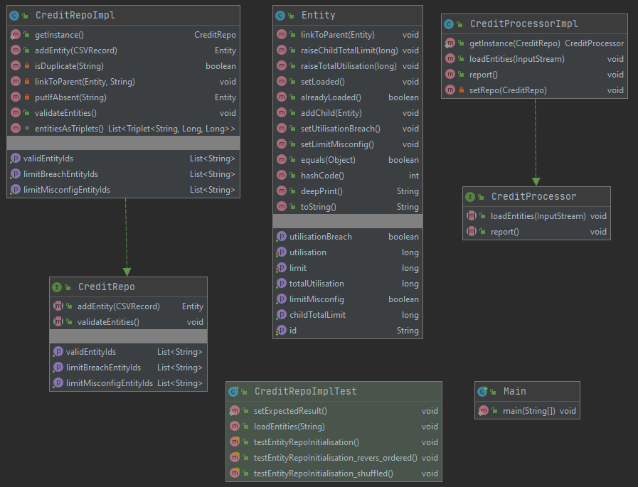
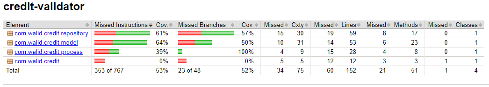

# Credit Validator

## Overview
This is a java 8 based exercise that accepts a tree of credit entities in an unordered CSV file and applies some limit validations on.

## Main Features
- Credit entities CSV file is accepted as a command line parameter.
- A credit validation report is printed on screen.
- Logs are generated to a disk file


## Main Technology Choices
- Multitiered design (frontend processor, data tier consisting of a handful of entity beans and a repository tier in the middle between the processor and the data entities).
- Gralde used to manage dependencies and generate the uber JAR.
- JaCoCo used to measure and generate test coverage report.
- Junit used to create Unit/Integration tests.

## UML Class Diagram


## Synopsis
To build (package) the uber JAR
```bash
$ ./gradlew build
```
To run the application
```bash
$ java -Djava.util.logging.config.file=logging.properties -jar build/libs/credit-validator-1.0.0.jar credit-limits.csv
Valid Entities (No breaches):
A, B, C, D, F,
Limit Breach Entities:
E,
Limit Misconfiguration Entities:


$ tail -12 credit-validator.log
Entity[id='A', parent=, childrenCount=1, limit=100, childTotalLimit=90, utilisation=0, totalUtilisation=60, isLoaded=true, utilisationBreach=false, limitMisconfig=false]
Thu Sep 10 18:29:49 AEST 2020 INFO:
Entity[id='B', parent=A, childrenCount=2, limit=90, childTotalLimit=80, utilisation=10, totalUtilisation=60, isLoaded=true, utilisationBreach=false, limitMisconfig=false]
Thu Sep 10 18:29:49 AEST 2020 INFO:
Entity[id='C', parent=B, childrenCount=0, limit=40, childTotalLimit=0, utilisation=20, totalUtilisation=20, isLoaded=true, utilisationBreach=false, limitMisconfig=false]
Thu Sep 10 18:29:49 AEST 2020 INFO:
Entity[id='D', parent=B, childrenCount=0, limit=40, childTotalLimit=0, utilisation=30, totalUtilisation=30, isLoaded=true, utilisationBreach=false, limitMisconfig=false]
Thu Sep 10 18:29:49 AEST 2020 INFO:
Entity[id='E', parent=, childrenCount=1, limit=200, childTotalLimit=100, utilisation=150, totalUtilisation=230, isLoaded=true, utilisationBreach=true, limitMisconfig=false]
Thu Sep 10 18:29:49 AEST 2020 INFO:
Entity[id='F', parent=E, childrenCount=0, limit=100, childTotalLimit=0, utilisation=80, totalUtilisation=80, isLoaded=true, utilisationBreach=false, limitMisconfig=false]
Thu Sep 10 18:29:49 AEST 2020 INFO: Report generated successfully
$
```

## Test Coverage Report
